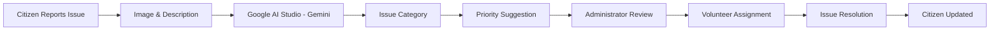
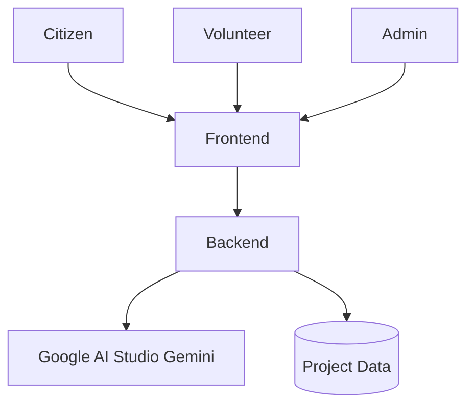
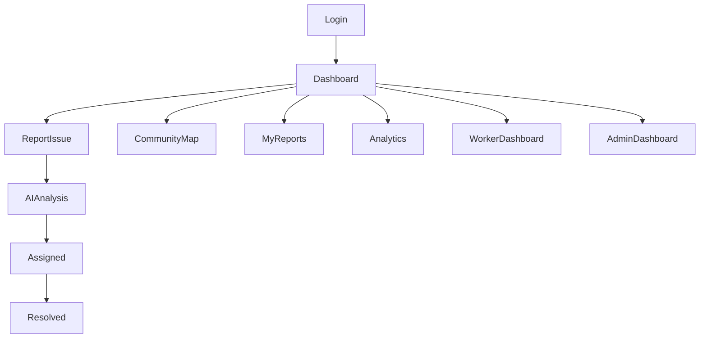

<div align="center">

</div>

# Run and deploy your AI Studio app

This contains everything you need to run your app locally.

View your app in AI Studio: https://ai.studio/apps/15ff084c-1c35-47a9-ac4f-483b9718c504

## Run Locally

**Prerequisites:**  Node.js


1. Install dependencies:
   `npm install`
2. Set the `GEMINI_API_KEY` in [.env.local](.env.local) to your Gemini API key
3. Run the app:
   `npm run dev`
# 🦸 Community Hero AI

### *AI-Powered Hyperlocal Problem Solver*

<p align="center">


</p>

---

# 🌍 Overview

**Community Hero AI** is an intelligent civic issue management platform that empowers communities to report, monitor, and resolve local infrastructure problems efficiently.

Citizens can report issues such as potholes, damaged streetlights, garbage accumulation, water leaks, and other public infrastructure concerns. The platform leverages **Google AI Studio (Gemini)** to analyze reports, assist with categorization, and streamline issue management.

---

# 🎯 Problem Statement

Many communities struggle with:

* Delayed issue reporting
* Lack of transparency
* Manual categorization
* Poor communication
* No centralized tracking system

Community Hero AI addresses these challenges through an AI-assisted workflow and a role-based management system.

---

# ✨ Key Features

| Feature                | Description                                                     |
| ---------------------- | --------------------------------------------------------------- |
| 📝 Issue Reporting     | Citizens can submit civic issues with descriptions and images   |
| 🤖 AI Analysis         | Google Gemini assists with categorizing and summarizing reports |
| 🗺 Interactive Map     | View issues geographically within the community                 |
| 👨‍💼 Admin Dashboard  | Manage reports and assign volunteers                            |
| 👷 Volunteer Dashboard | View assigned tasks and update issue status                     |
| 📊 Analytics Dashboard | Visualize issue trends and resolution statistics                |
| 🔐 Role-Based Access   | Separate interfaces for citizens, admins, and volunteers        |

---

# 🤖 AI Workflow



---

# 🏗 System Architecture



---

# 🖥 Application Workflow



---

# 📸 Application Screenshots

## 🔐 Login


---

## 🏠 Citizen Dashboard


---

## 📝 Report Issue


---

## 🗺 Community Map


---

## 👨‍💼 Admin Dashboard


---

## 👷 Volunteer Dashboard


---

## 📊 Analytics Dashboard


---

# 📊 Project Highlights

```text
✔ AI Assisted Issue Categorization

✔ Interactive Community Map

✔ Real-Time Issue Tracking

✔ Role-Based Access

✔ Analytics Dashboard

✔ Volunteer Assignment

✔ Hyperlocal Community Management
```

---

# 🛠 Tech Stack

## Frontend

* React
* TypeScript
* Vite
* CSS

## Backend

* Node.js
* TypeScript

## Artificial Intelligence

* Google AI Studio
* Gemini API

---

# 📂 Project Structure

```
community-hero-ai/

├── assets/

├── data/

├── src/

│   ├── components/

│   ├── data/

│   ├── App.tsx

│   ├── main.tsx

│   └── types.ts

├── server.ts

├── package.json

├── vite.config.ts

├── tsconfig.json

└── README.md
```

---

# 🚀 Installation

Clone the repository

```bash
git clone https://github.com/abhishekdaramoni-spec/community-hero-ai.git
```

Move into the project directory

```bash
cd community-hero-ai
```

Install dependencies

```bash
npm install
```

Create a `.env` file

```env
GEMINI_API_KEY=YOUR_API_KEY
```

Run the application

```bash
npm run dev
```

---

# 🔒 Security

* Environment variable based API configuration
* Secure authentication workflow
* Role-based authorization
* Community-specific data visibility
* Protected AI API usage

---

# 🌍 Possible Applications

* Smart Cities
* Municipal Corporations
* Residential Communities
* Educational Campuses
* Housing Societies
* Village Development

---

# 🚀 Future Enhancements

* 📱 Mobile Application
* 🌐 Multi-language Support
* 🔔 Push Notifications
* 🎙 Voice-Based Reporting
* 📍 GPS Location Detection
* 📷 Improved AI Vision Analysis
* 📴 Offline Reporting
* ☁ Cloud Database Integration

---

# 👨‍💻 Developer

**Abhishek Daramoni**

GitHub:

https://github.com/abhishekdaramoni-spec

---

# ⭐ Support

If you found this project useful, consider giving it a ⭐ on GitHub.
