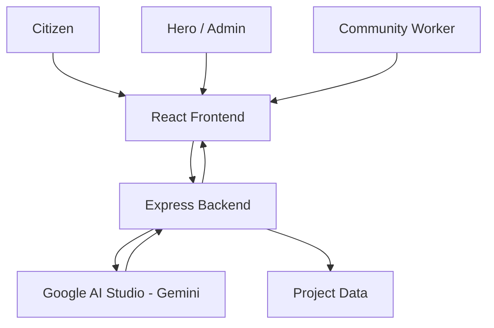
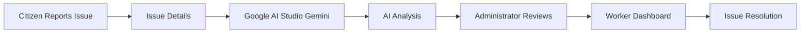
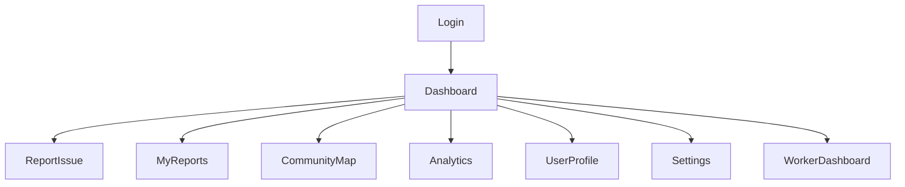

<div align="center">

</div>

# Run and deploy your AI Studio app

This contains everything you need to run your app locally.

View your app in AI Studio: https://ai.studio/apps/15ff084c-1c35-47a9-ac4f-483b9718c504

## Run Locally

**Prerequisites:**  Node.js


1. Install dependencies:
   `npm install`
2. Set the `GEMINI_API_KEY` in [.env.local](.env.local) to your Gemini API key
3. Run the app:
   `npm run dev`
<div align="center">

# 🦸 Community Hero AI

### **AI-Powered Hyperlocal Problem Solver**

### *Empowering Communities Through Intelligent Civic Issue Management*


> **Report • Analyze • Assign • Resolve**

---


---

### 🌍 Making Community Problem Solving Smarter with Artificial Intelligence

Community Hero AI is an AI-powered civic issue management platform that enables citizens, administrators, and community workers to collaborate efficiently in identifying, managing, and resolving local infrastructure issues.

Built using **React**, **TypeScript**, **Express**, and **Google AI Studio (Gemini)**, the platform provides intelligent issue analysis, role-based dashboards, interactive mapping, and analytics to improve transparency and community engagement.

</div>

---

# 📖 About The Project

Modern communities often face recurring civic problems such as damaged roads, overflowing garbage bins, water leakages, broken streetlights, and other public infrastructure issues. Traditional complaint systems are often slow, fragmented, and lack transparency, making it difficult for citizens to track the progress of their reports.

**Community Hero AI** addresses these challenges by providing a centralized platform where citizens can report issues, administrators can manage and assign them, and community workers can update the progress until resolution.

To enhance efficiency, the platform integrates **Google AI Studio (Gemini)**, enabling AI-assisted analysis that supports smarter issue management and improves the overall reporting experience.

---

# 🎯 Objectives

The primary objectives of Community Hero AI are:

- Enable citizens to report civic issues digitally.
- Simplify issue management for administrators.
- Improve communication between citizens and workers.
- Provide AI-assisted analysis using Google AI Studio.
- Increase transparency through status tracking.
- Visualize community issues on an interactive map.
- Present meaningful analytics for better decision-making.

---

# 💡 Why Community Hero AI?

Community Hero AI combines Artificial Intelligence with an intuitive web platform to create a smarter approach to civic issue management.

Instead of relying on traditional complaint systems, users benefit from:

- AI-assisted issue analysis
- Centralized issue management
- Interactive visualization
- Transparent tracking
- Role-based collaboration
- Community-focused reporting

The platform demonstrates how modern AI technologies can improve public services while encouraging greater community participation.

---
# ✨ Features

Community Hero AI provides an intelligent, role-based platform for managing civic issues within a community. The application combines AI-assisted analysis with interactive dashboards to simplify reporting, tracking, and resolution.

---

## 👤 Citizen Features

| Feature | Description |
|----------|-------------|
| 📝 Report Issues | Submit civic issues with descriptions and images. |
| 📂 My Reports | View and track previously submitted reports. |
| 👤 User Profile | Manage personal profile information. |
| 🗺 Community Map | View reported issues on an interactive map. |
| 🔔 Notifications | Receive important application updates. |
| 🌙 Theme Support | Switch between Light and Dark mode. |

---

## 👨‍💼 Administrator (Hero) Features

Administrators have complete visibility of community issues and management tools.

### Dashboard

- 📊 View community statistics
- 📈 Monitor issue analytics
- 📋 Review reported issues
- 👥 View community members
- ⚙ Access system settings

### Issue Management

- Review submitted reports
- Monitor issue progress
- Manage community information
- Access AI-generated insights
- View issue details

---

## 👷 Community Worker Features

Community workers receive assigned responsibilities through a dedicated dashboard.

### Worker Dashboard

- View assigned issues
- Review issue details
- Update issue status
- Track work progress

---

# 🤖 AI-Powered Assistance

Community Hero AI integrates **Google AI Studio (Gemini)** to enhance issue management through AI-assisted analysis.

### AI Capabilities

- Intelligent issue analysis
- AI-generated report insights
- Improved report understanding
- Assistance during issue review

> Google AI is designed to support administrators during issue management by providing additional context and analysis.

---

# 🗺 Interactive Community Map

The application includes an interactive map interface to improve the visibility of reported civic issues.

### Map Highlights

- Interactive visualization
- Community-focused reporting
- Location-based issue viewing
- Easy navigation between reports

---

# 📊 Analytics Dashboard

The Analytics Dashboard provides an overview of community activity through visual charts and summary cards.

### Dashboard Includes

- Community statistics
- Report overview
- Issue trends
- Summary metrics
- AI-generated analytical insights

---

# 👥 Community Members

Administrators can access a dedicated members section to view community participants and improve coordination.

---

# 👤 User Profile

Every user has access to a profile page where personal information can be viewed and managed.

---

# ⚙ System Settings

The platform includes a dedicated settings page for application configuration and management.

---

# 🎨 Modern User Experience

Community Hero AI focuses on providing a clean and intuitive user experience.

### Highlights

- Responsive interface
- Light & Dark themes
- Clean dashboard layout
- Interactive cards
- Organized navigation
- Modern React-based UI

---

# 📌 User Roles

| Role | Responsibilities |
|------|------------------|
| 👤 Citizen | Report issues, view reports, monitor progress |
| 👨‍💼 Hero (Administrator) | Review reports, manage community information, access analytics |
| 👷 Community Worker | View assigned tasks and update issue status |

---

# 🚀 Why Community Hero AI?

Community Hero AI combines Artificial Intelligence with an intuitive web application to create a transparent and efficient civic issue management platform.

By bringing together citizens, administrators, and community workers within a single system, the application encourages better communication, improved organization, and smarter decision-making through AI-assisted analysis.
# 🏗 System Architecture



---

# 🤖 AI Workflow



---

# 🔄 Application Workflow



---

# 📸 Application Preview

> Replace these placeholders with actual screenshots.

| Login | Dashboard |
|--------|-----------|
|  |  |

---

| Report Issue | Community Map |
|---------------|---------------|
|  |  |

---

| Analytics | Worker Dashboard |
|------------|-----------------|
|  |  |

---
# 🛠 Technology Stack

## Frontend

- React
- TypeScript
- Vite
- CSS

---

## Backend

- Node.js
- Express.js

---

## Artificial Intelligence

- Google AI Studio
- Gemini API

---

## Data Visualization

- Recharts

---

## Interactive Maps

- React Leaflet
- Leaflet

---

## Development

- Git
- GitHub
- npm
- Visual Studio Code

---

# ☁ Google Technologies Used

The project utilizes the following Google technologies:

| Technology | Purpose |
|------------|---------|
| Google AI Studio | AI-assisted issue analysis |
| Gemini API | Intelligent report insights |
| Google Cloud Run | Cloud deployment |

---

# 📂 Project Structure

```text
community-hero-ai/

├── assets/

├── data/

├── src/

│   ├── components/

│   ├── data/

│   ├── App.tsx

│   ├── main.tsx

│   └── types.ts

├── server.ts

├── package.json

├── vite.config.ts

├── tsconfig.json

└── README.md
```

---

# 🚀 Installation

Clone the repository

```bash
git clone https://github.com/abhishekdaramoni-spec/community-hero-ai.git
```

Move into the project directory

```bash
cd community-hero-ai
```

Install dependencies

```bash
npm install
```

Create a `.env` file

```env
GEMINI_API_KEY=YOUR_API_KEY
```

Run the development server

```bash
npm run dev
```

---

# 🔒 Security

The application follows good development practices by:

- Using environment variables for API configuration.
- Keeping sensitive credentials outside the source code.
- Providing role-based access for different user types.
- Separating frontend and backend responsibilities.

---

# 🎯 Project Goals

- Simplify civic issue reporting.
- Improve transparency within communities.
- Assist administrators with AI-generated insights.
- Provide interactive visualization of community issues.
- Enable efficient collaboration between citizens, administrators, and workers.

---
